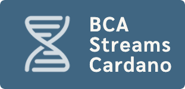

by project [BCA ](https://github.com/Blockchain-Data-Analytics)

# Cardano Streams

## Content

- [Signup to this service](#signup-for-this-service)
- [Data source](#data-source)

## Signup for this service

Please, get in touch with us at "info AT blockchain-applied.com" so we can evaluate your needs and discuss different options.

We cannot provide you with a strict SLA. But, we promise to keep the services alive and fix technical problems asap. We have decent monitoring in place and will be able to react to service disruption.

See our [main page](https://github.com/Blockchain-Data-Analytics) for contact details.

## Data source

The data is derived using [Db-sync](https://github.com/IntersectMBO/cardano-db-sync) from Cardano's main chain.

We provide you with a complete setup containing all credentials to connect to our high-availability PostgreSQL servers.

Prerequisites: you need to have [Docker](https://www.docker.com/products/docker-desktop/) installed.

Disk space requirement: &ge; 350 GB.
